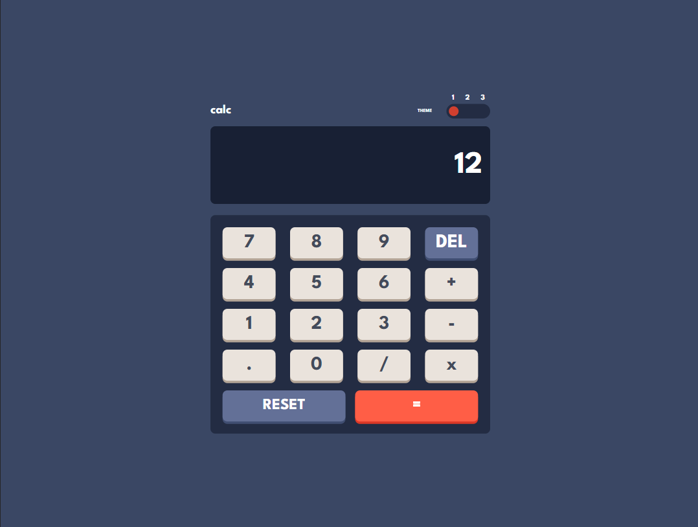
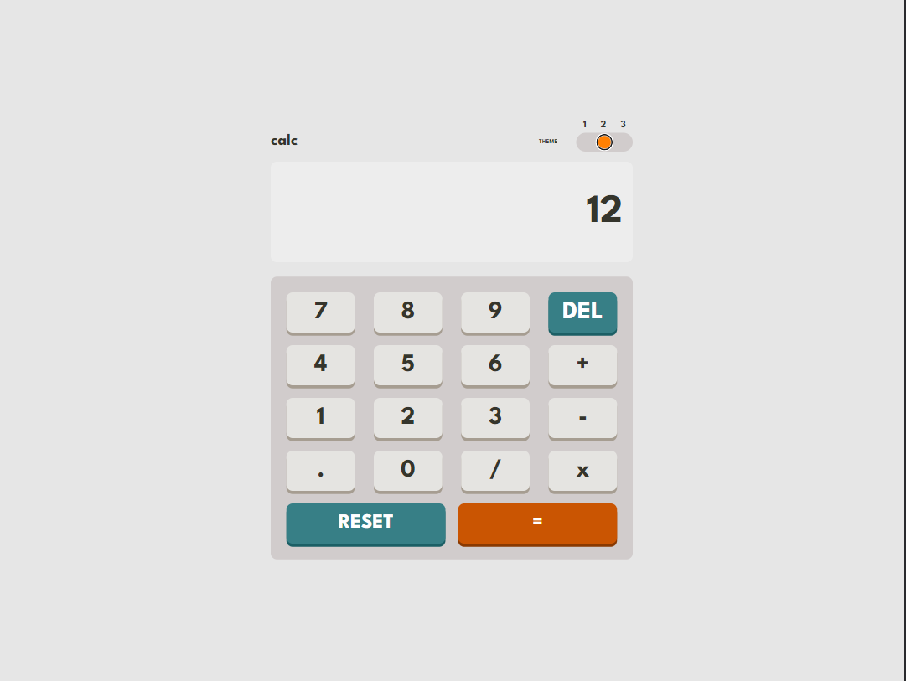
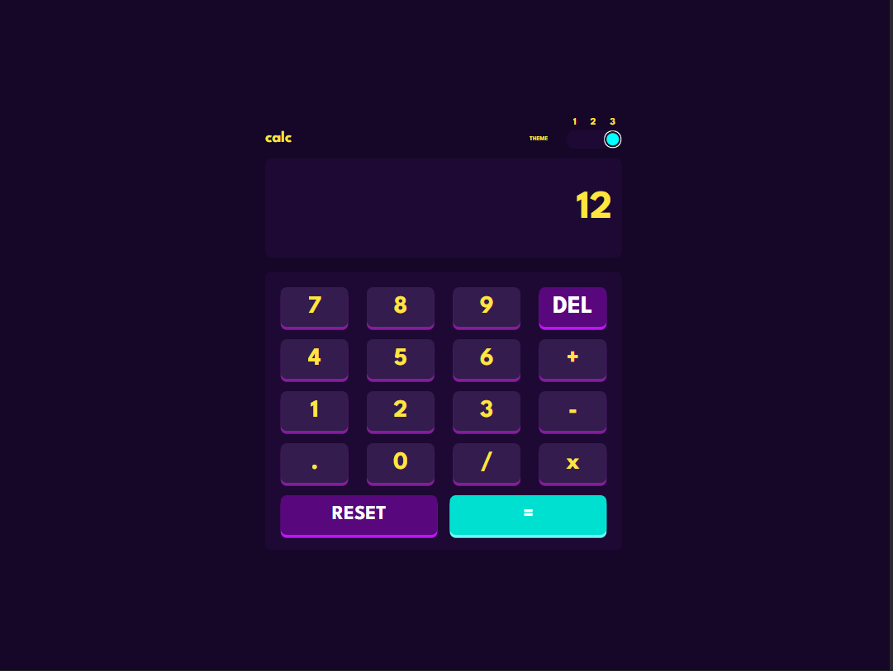

# Frontend Mentor - Calculator app solution

This is a solution to the [Calculator app challenge on Frontend Mentor](https://www.frontendmentor.io/challenges/calculator-app-9lteq5N29). Frontend Mentor challenges help you improve your coding skills by building realistic projects. 

## Table of contents

- [Overview](#overview)
  - [The challenge](#the-challenge)
  - [Screenshot](#screenshot)
  - [Links](#links)
- [My process](#my-process)
  - [Built with](#built-with)
  - [Continued development](#continued-development)
- [Author](#author)

**Note: Delete this note and update the table of contents based on what sections you keep.**

## Overview

### The challenge

Users should be able to:

- See the size of the elements adjust based on their device's screen size
- Perform mathematical operations like addition, subtraction, multiplication, and division
- Adjust the color theme based on their preference

### Screenshot

### Links

- Solution URL: [https://github.com/DennisBoanini/frontend-mentor-calculator-app](https://github.com/DennisBoanini/frontend-mentor-calculator-app)
- Live Site URL: [https://dennisboanini.github.io/frontend-mentor-calculator-app/](https://dennisboanini.github.io/frontend-mentor-calculator-app/)

## My process

### Built with

- [React](https://reactjs.org/) - JS library

### Continued development

I want to continue the study of the React library and all its related concepts.

## Author

- Frontend Mentor - [@DennisBoanini](https://www.frontendmentor.io/profile/DennisBoanini)
- LinkedIn - [Dennis A. Boanini](https://www.linkedin.com/in/dennisboanini)
